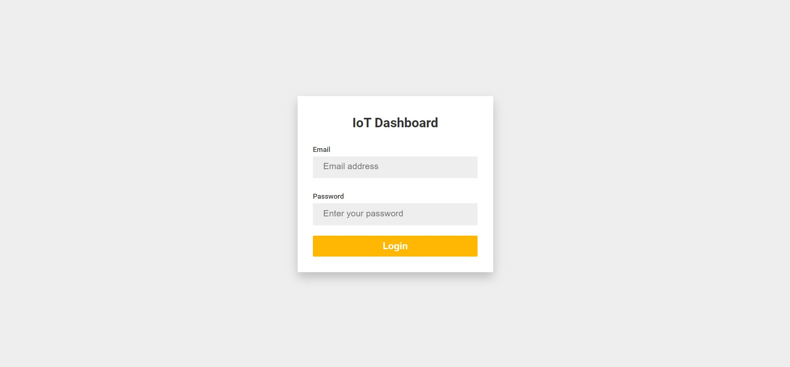
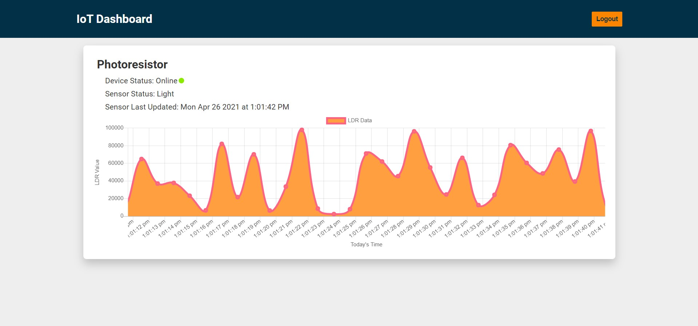

# IoT Dashboard

IoT Dashboard is a real-time web application made using ReactJS, NodeJS, ExpressJS & MongoDB.
Data is generated by sensor(s) in raspberry pi and sent to the Node server via WebSockets. The server then, broadcasts the
data to all the connected React clients and the sensor data gets displayed on the dashboard in real-time. The app consists
of admin login, Chart.js integration for displaying real-time data graph and text-based data components.

# Screenshots

### Login Screen

### Dashboard

